# 03장 클래스와 PyQt

쉽게 GUI(Graphical User Interface) 프로그램을 만들 수 있는 PyQt를 사용할 것이다. riverbankcomputing에서 개발한 파이썬 모듈로, Py는 파이썬을 의미하고 Qt는 GUI 프로그래밍을 위한 라이브러리를 의미한다. 

---

## PyQt로 Hello 출력

```Python
import sys
from PyQt5.QtWidgets import QApplication, QLabel

app = QApplication(sys.argv)
label = QLabel("Hello")
label.show()
app.exec_()
```

실행 화면은 다음과 같다. Hello라는 문자열이 적힌 윈도우가 나온다.

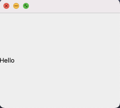

이제 코드를 살펴보자. PyQt5는 모듈 규모가 커서 디렉터리 안에 여러 파일(모듈)이 있는 구조다. 따라서 디렉터리의 계층 구조를 명시하기 위해 PyQt5.QtWidgets로 작성한다. 즉, 'from PyQt5.QtWidgets import QApplication, QLabel'는 PyQt5 디렉터리에 있는 QtWidget.py 파일에서 QApplication, QLabel을 import하라는 의미다.

> [QApplication이란?](https://onlytojay.medium.com/pyside2-1-%EA%B8%B0%EB%B3%B8%EB%8F%99%EC%9E%91%EC%9B%90%EB%A6%AC-72ea6572a65b)

> [sys.argv](https://wikidocs.net/133137)

QApplication은 Qt App 객체를 만드는 클래스다. 하지만 이 객체만 생성해서는 python은 '할 일을 다 했다.'라고 생각하고 프로그램을 종료하기 때문에, 대기 상태에 있도록 조정해야 한다. 프로그램을 무한 루프 상태로 만들면 되는데, 이 역할을 하는 구문이 바로 app.exec_()이다. exec는 execute의 약자이며, app이 종료되면 0을 return한다.

따라서 앱이 종료되면서 0을 반환 받으면 python은 루프를 빠져나와 정상 종료(sys.exit(0))를 하게 된다. 간단히 요약하면 '1. App 생성 2. App 무한 루프 3. 탈출 시 정상 종료' 과정을 거치게 된다.

QLabel은 GUI 프로그래밍을 위한 모듈이다. 예제에서는 label이라는 QLabel 클래스 객체를 생성했다. QLabel 윈도우에 출력될 문자열 'Hello'를 넘겨준 것이다. 생성된 객체는 label이라는 변수가 바인딩하고 있다. QLabel 클래스가 가진 show() 메서드를 사용해서 호출하면 윈도우가 화면에 나타나게 된다.

요약하면 PyQt로 프로그래밍할 때는 일반적으로 다음 두 가지가 필요하다.

1. QApplication 클래스의 인스턴스

2. 이벤트 루프

만약 예제에서 app.exec_()를 넣지 않았다면, 프로그램이 정상적으로 종료되지 않는다. 실행 로그를 보면 다음과 같이 출력된다.

```
Process finished with exit code 1
```

파이썬 코드는 인터프리터가 첫 번째 라인부터 코드를 실행하며 더 실행할 코드가 없으면 프로그램을 종료한다. 하지만 GUI 프로그래밍은 출력된 윈도우에서 사용자가 'X' 버튼을 누르기 전까지는 프로그램이 종료되지 않게 해야 한다. 따라서 무한 루프를 넣는 것이며, GUI 프로그래밍에서는 이를 '이벤트 루프'라고 한다. 참고로 app.exec_()를 넣으면 정상적으로 종료가 되며 실행 로그에 다음과 같은 문장이 출력된다.

```
Process finished with exit code 0
```

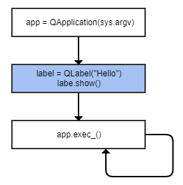


---


## 위젯과 윈도우

> [PyQt5 위젯 목록](https://wikidocs.net/21933)

아래 그림은 GUI 프로그램에서 사용할 수 있는 여러 컴포넌트를 보여준다. 앞서 만든 버튼과 같은 컴포넌트를 PyQt에서는 위젯이라고 부른다.

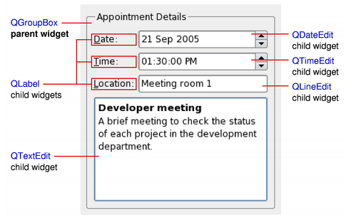

위젯은 다른 위젯에 포함될 수 있는데, 다른 위젯에 포함되지 않는 최상위 위젯을 특별히 **윈도우**라고 부른다. PyQt에서 윈도우를 생성할 때는 QMainWindow 클래스나 QDialog 클래스를 사용한다.


## 나만의 윈도우 클래스 정의하기

다음은 화면에 출력되는 UI를 구성하기 위한 클래스 MyWindow를 사용한 예제다.

```Python
import sys
from PyQt5.QtWidgets import QApplication, QMainWindow

class MyWindow(QMainWindow):
    def __init__(self):
        super().__init__()

app = QApplication(sys.argv)
window = MyWindow()
window.show()
app.exec_()
```

실행 시 다음과 같은 윈도우가 출력된다.

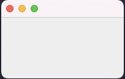


### 윈도우 크기 조절

여기서 윈도우 크기와 출력되는 위치를 변경해 보자. QMainWindow 클래스는 윈도우 크기 및 출력 위치를 변경하는 setGeometry() 메서드를 가지고 있다.

```Python
import sys
from PyQt5.QtWidgets import QApplication, QMainWindow

class MyWindow(QMainWindow):
    def __init__(self):
        super().__init__()
        self.setGeometry(100, 200, 300, 400)

app = QApplication(sys.argv)
window = MyWindow()
window.show()
app.exec_()
```

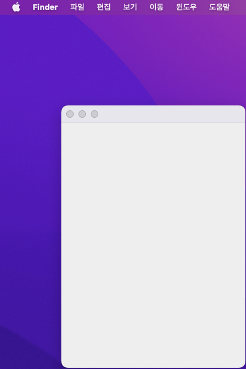

setGeometry의 각 인자는 (x축 위치, y축 위치, 윈도우 너비, 윈도우 높이)를 의미한다.

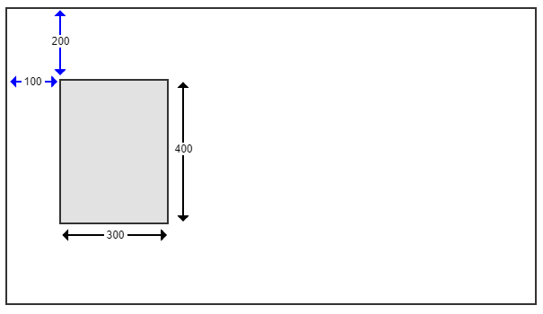


### 윈도우 타이틀 텍스트, 아이콘 변경

QMainWindow 클래스의 setWindowTitle() 메서드로 제목을, setWindowIcon() 메서드로 아이콘을 변경할 수 있다.

```Python
import sys
from PyQt5.QtWidgets import QApplication, QMainWindow
from PyQt5.QtGui import QIcon

class MyWindow(QMainWindow):
    def __init__(self):
        super().__init__()
        self.setGeometry(100, 200, 300, 200)
        self.setWindowTitle("PyQt")
        self.setWindowIcon(QIcon("icon.png"))

app = QApplication(sys.argv)
window = MyWindow()
window.show()
app.exec_()
```

이때 QIcon 클래스는 QtGui 파일에 정의되어 있기 때문에, 'from PyQt5.QtGui import QIcon'을 추가해야 한다.


### 버튼 추가 및 콜백 함수 적용하기

다음은 버튼 두 개를 구현하고 클릭 이벤트를 추가한 코드다. QPushButton 클래스로 버튼을 구현할 수 있다. 아래는 QPushButton으로 구현한 인스턴스에 자주 쓰이는 메서드다.

| 메서드 | 설명 |
| --- | --- |
| setCheckable() | True 설정 시, 누른 상태와 그렇지 않은 상태를 구분한다. |
| toggle() | 상태를 바꾼다. |
| setIcon() | 버튼 아이콘을 설정한다. |
| setEnabled() | FALSE 설정 시, 버튼을 사용할 수 없다. |
| isChecked() | 버튼의 선택 여부를 반환한다. |
| setText() | 버튼에 표시될 텍스트를 설정한다. |
| text() | 버튼에 표시된 텍스트를 반환한다. |

자주 쓰이는 시그널은 다음과 같다. 시그널은 '위젯에 정의된 이벤트'를 뜻한다.(이벤트 발생 때 호출되는 함수나 메서드는 슬롯(slot)이라 부른다.)

| 시그널 | 설명 |
| --- | --- |
| clicked() | 버튼을 클릭하면 발생한다. |
| pressed() | 버튼을 누르고 있으면 발생한다. |
| released() | 버튼을 눌렀다 떼면 발생한다. |
| toggled() | 버튼의 상태가 바뀔 때 발생한다. |

```Python
import sys
from PyQt5.QtWidgets import QApplication, QMainWindow, QPushButton
from PyQt5.QtGui import QIcon

class MyWindow(QMainWindow):
    def __init__(self):
        super().__init__()
        self.setGeometry(100, 200, 300, 200)
        self.setWindowTitle("PyQt")
        self.setWindowIcon(QIcon("icon.png"))

        btn = QPushButton("버튼1", self)
        btn.move(10, 10)
        btn.clicked.connect(self.btn_clicked)    # connect 메서드
                                                 # :이벤트 발생 시 처리할 메서드를 연결한다.

        btn2 = QPushButton("버튼2", self)
        btn2.move(10, 40)
        btn2.clicked.connect(self.btn_clicked)

    def btn_clicked(self):    # 버튼이 눌리면 처리할 메서드
        print("버튼 클릭")

app = QApplication(sys.argv)
window = MyWindow()
window.show()
app.exec_()
```

QPushButton 클래스의 인스턴스를 만든다. 그 뒤 버튼 출력 위치를 move() 메서드로 조정했다.

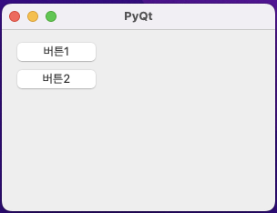

또한 구현된 버튼에 클릭 이벤트를 추가했다. exec_() 메서드로 이벤트 루프가 생성되고 루프를 돌고 있다가, 사용자가 이벤트를 발생시키면 이벤트(여기서는 클릭 이벤트)에 연결된 메서드를 호출해 준다.

GUI 프로그래밍에서는 이벤트가 발생하면 해당 이벤트에 연결된 메서드를 호출한다. 이처럼 프로그래머가 직접 메서드를 호출하지 않고, 이벤트 루프가 메서드를 호출하는 것을 '콜백 함수'라고 부른다.

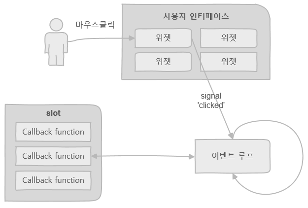


---


## 코빗 시세 조회기 만들기

우선 UI 구조를 만들 것이다. Qt Designer 프로그램을 이용해서 만든다.

위젯 상자에서 Label(비트코인 현재가: ), Line Edit(가격 표시 박스), Push Button(조회 버튼)를 드래그하여 배치했다. 속성 편집기에서 windowTitle을 코빗 시세 조회기로 변경하고, 'window.ui'로 다른 이름으로 저장했다.

아래는 command + R로 미리보기 창으로 표시된 화면이다.

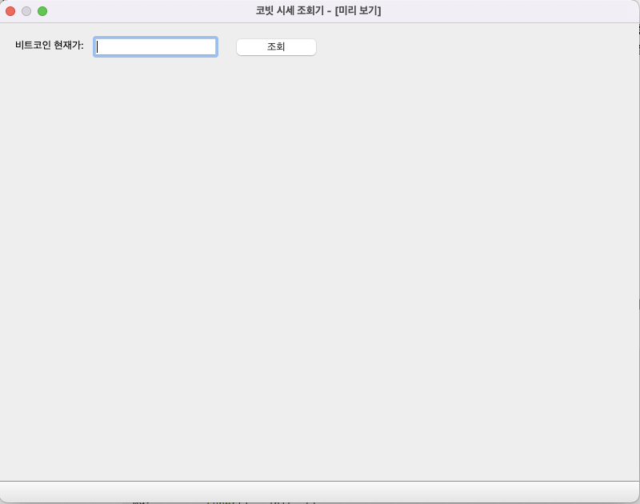

이제 만든 UI 파일을 읽어서 구현한다. 그런데 Qt Designer에서 만든 *.ui 파일은 XML 언어로 되어 있다. 따라서 uic 모듈의 loadUiType() 메서드을 사용해서, 이를 파이썬 클래스로 만들어야 한다. loadUiType() 메서드를 사용하면 파이썬 코드로 직접 객체를 생성한 것과 동일한 결과물을 얻을 수 있다.

또한 비트코인 현재가를 얻어오기 위해 Korbit API를 설치했다.

```
$ pip install pykorbit
$ pip install -U pykorbit (업데이트)
```

다음은 구현한 코드다.(03_23.py 파일)

```Python
import os
import pykorbit    # 비트코인 현재가를 쉽게 얻을 수 있는 pykorbit 모듈
import sys
from PyQt5.QtWidgets import QApplication, QMainWindow, QPushButton
from PyQt5 import uic

ui_path = os.path.dirname(os.path.abspath(__file__))

form_class = uic.loadUiType(os.path.join(ui_path, "window.ui"))[0]

class MyWindow(QMainWindow, form_class):
    def __init__(self):
        super().__init__()
        self.setupUi(self)    # setupUi(): QT Designer에서 만든 클래스들을 초기화한다.
        self.pushButton.clicked.connect(self.inquiry)

    def inquiry(self):
        price = pykorbit.get_current_price("BTC")
        self.lineEdit.setText(str(price))
        # print(price)

app = QApplication(sys.argv)
window = MyWindow()
window.show()
app.exec_()
```

다음은 윈도우 창 결과물 사진이다.

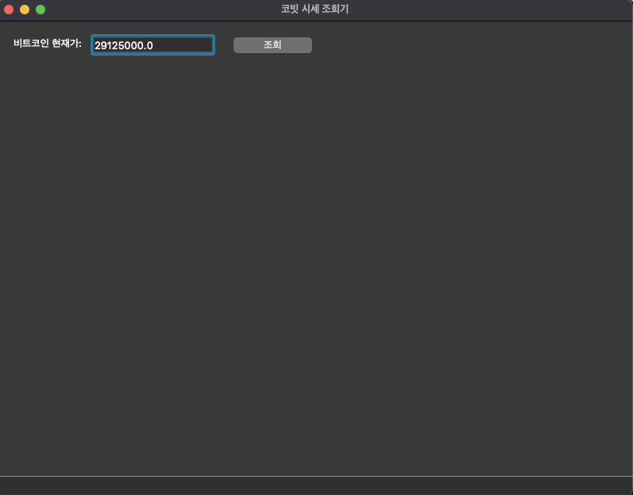


### 일정 시간마다 자동 조회하기

위에서 구현한 현재가 프로그램은 매번 조회를 눌러야 해서 번거로웠다. QTimer을 사용해서 주기적으로 작업을 되풀이하면 이런 문제를 해결할 수 있다. interval을 설정할 수 있는 QTimer 클래스와, 시간을 받아올 수 있는 QTime 클래스를 Qtcore 파일에서 import했다.

```Python
import os
import pykorbit    # 비트코인 현재가를 쉽게 얻을 수 있는 pykorbit 모듈
import sys
from PyQt5.QtWidgets import QApplication, QMainWindow
from PyQt5 import uic
from PyQt5.QtCore import QTimer, QTime

ui_path = os.path.dirname(os.path.abspath(__file__))

form_class = uic.loadUiType(os.path.join(ui_path, "window.ui"))[0]

class MyWindow(QMainWindow, form_class):
    def __init__(self):
        super().__init__()
        self.setupUi(self)
        
        self.timer = QTimer(self)
        self.timer.start(1000)                      # interval은 1초(1000): 즉 시계처럼 동작한다.
        self.timer.timeout.connect(self.inquiry)    # timeout: interval 마다 발생하는 이벤트

    def inquiry(self):
        cur_time = QTime.currentTime()              # 현재 시각을 받아온 뒤
        str_time = cur_time.toString("hh:mm:ss")    # 문자열 타입으로 변경한다.
        self.statusBar().showMessage(str_time)
        price = pykorbit.get_current_price("BTC")
        self.lineEdit.setText(str(price))
        # print(price)

app = QApplication(sys.argv)
window = MyWindow()
window.show()
app.exec_()
```

다음은 윈도우 창 결과물 사진이다.

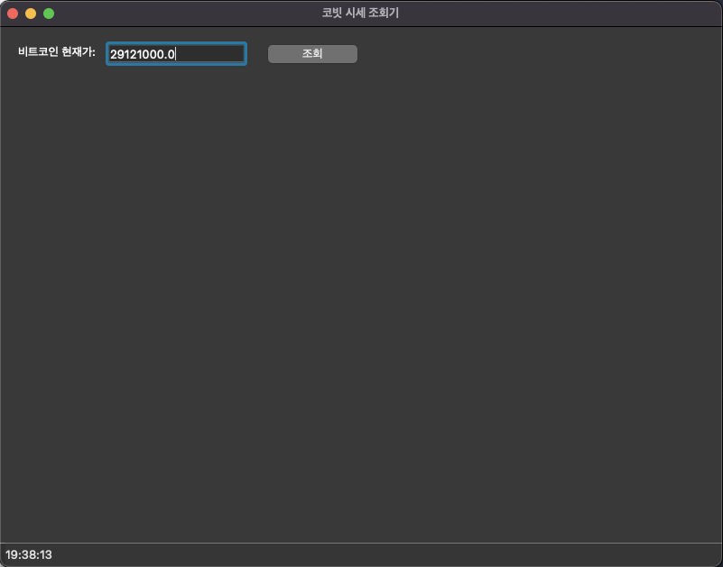

